# Yazılım Mühendisliği Güncel Konular

Hava Kalitesi Analizi

## Aşama 1 - Veri Toplama

#### Amaç
Bu projedeki amaç tüm Türkiye'yi ve Konya ilini kapsayan bir çalışma gerçekleştirmek ve hava kalitesinin istihdam oranlarında ne gibi etkileri olduğunu tahmin etmeye çalışmak.

#### Projede Kullanılan Kaynak ve Araçlar

Veri kaynağı olarak "www.havaizleme.gov.tr" sitesinden faydalanılmıştır. 
Projede **Python** dili kullanılmıştır. 
Bazı hesaplamalar ve düzenlemeler için **pandas** ve **numpy** kütüphaneleri kullanılmıştır. 
Grafikler için **seaborn** ve **matplotlib** kütüphaneleri kullanılmıştır. 
Tahmin modeli için **fbprophet** kütüphanesi kullanılmıştır. 
Veri seti düzenleme işlemleri için **Not Defteri** kullanılmıştır.

#### Tanımlar Ve Kısaltmalar

**tur.csv**: İçerisinde 2019 yılında Türkiye'nin bütün illerine ait günlük olarak hava verilerinin bulunduğu veri seti. 
**konya.csv**: İçerisinde Konya iline ait 2019 yılında PM10 değerinin günlük olarak bulunduğu veri seti. 
**hava.py**: Türkiye'nin hava kalitesinin incelendiği ve gerekli grafiklerin oluşturulduğu python dosyası. 
**fbprophet.py**: Konya iline ait 2020 yılı için geleceğe yönelik veri tahmininde bulunan python dosyası. 

**PM10** : Çapı 10 mikrometreden küçük maddeler. 
**SO2** : Kükürt Dioksit Gazı 
**CO** : Karbonmonoksit Gazı 
**NO2** : Azot Dioksit Gazı 
**NOX** : Azot Oksit Gazları 
**NO** : Azot Oksit Gazı 
**O3** : Ozon Gazı 

## Aşama 2 - Verinin Görselleştirilmesi ve Sunumu

tur.cvs veri seti toplam 25722 satır ve 9 sutundan oluşmaktadır.

Sayısal değerler olan verileri Not Defteri aracılığı ile sayı değerleri ondalık ayırmada kullanılan virgülü nokta ile kolon ayırıcı olarak kullanılan boşluk değeri virgül olarak değiştirildi ve txt uzantılı dosya csv olarak kaydedildi.

Grafikler gösterilirken özellikler şehirlere göre sınıflandırıldı. Gösterilen değerler en yüksekten en düşüğe göre sıralandı.

**PM10** Değerinin 2019 yılında şehirlere göre dağılımı.

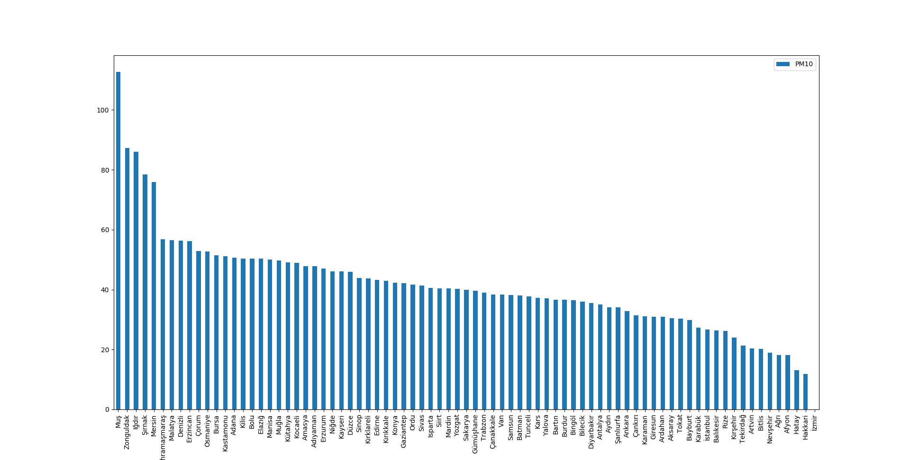

Boş değerleri en az olan PM10 değerinde 2019 yılında en yüksek olan 3 şehrimiz Muş, Zonguldak ve Iğdır olmuştur.

**SO2** Değerinin 2019 yılında şehirlere göre dağılımı.

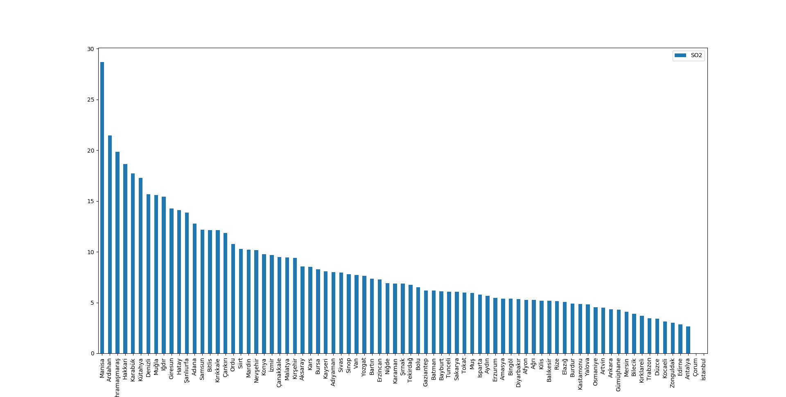

SO2 değerlerinde 2019 yılında en yüksek olan 3 şehrimiz Manisa, Ardahan ve Kahramanmaraş olarak görülmektedir.

**CO** Değerinin 2019 yılında şehirlere göre dağılımı.

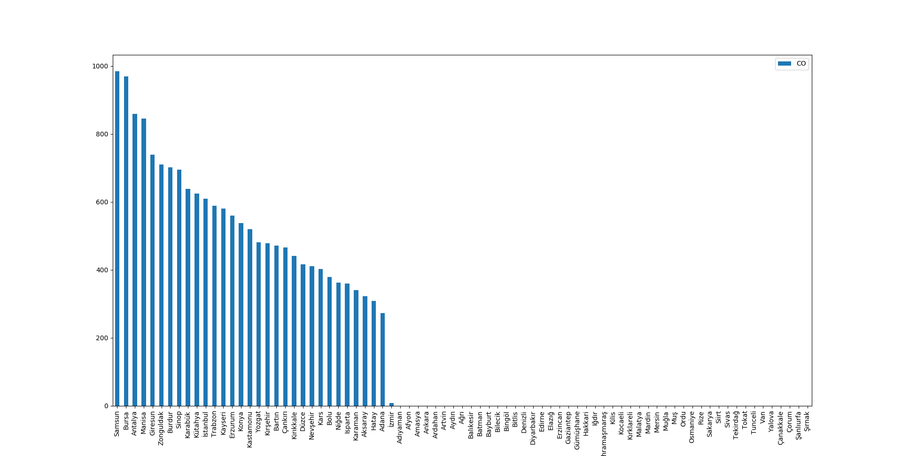

Veri setinde yüksek boş değere sahip olan CO değeri olarak 2019 yılında en yüksek değere sahip 3 şehir Samsun, Bursa ve Antalya olmuştur.

**NO2** Değerinin 2019 yılında şehirlere göre dağılımı.

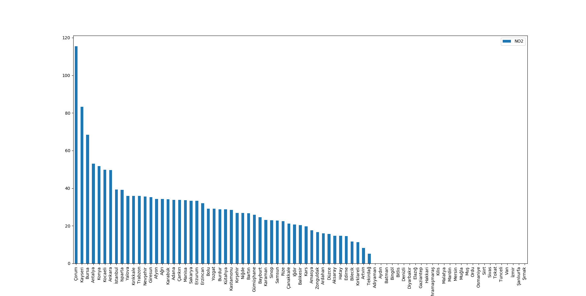

2019 yılında en yüksek NO2 değerine sahip olan üç şehir Çorum, Kayseri ve Bursa olarak görülmektedir.

**NOX** Değerinin 2019 yılında şehirlere göre dağılımı

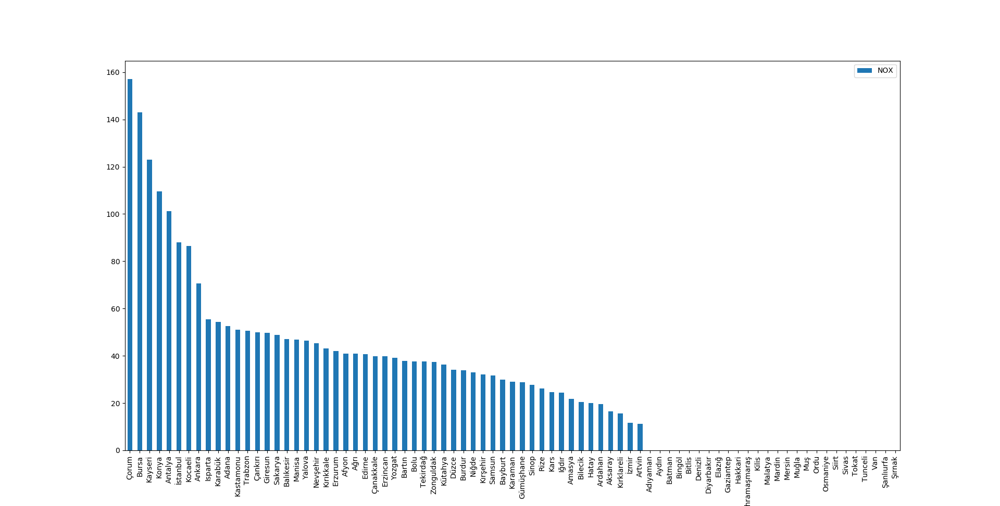

2019 yılında en yüksek NOX değerine sahip olan üç şehir Çorum, Kayseri ve Bursa olarak görülmektedir.

**O3** Değerinin 2019 yılında şehirlere göre dağılımı.

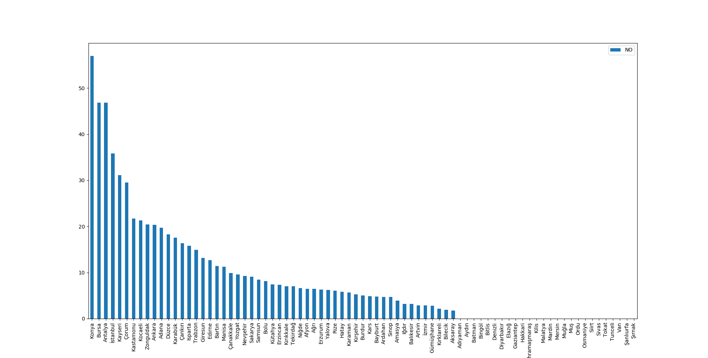

2019 yılında en yüksek O3 değerine sahip olan üç şehir Hatay, Bilecik ve Isparta olarak görülmektedir.

## Aşama 3 - Verinin Karakteristiklerinin Analizi

**PM10** = Partiküler Madde (PM10) ve çapı 10 mikrometreden küçük diğer tanecikler akciğerlere ulaşarak iltihaplanmaya ya da insanları çok olumsuz etkileyecek kalp ve akciğer hastalıklarına neden olabilirler. Oluşma sebeplerinden biri katı yakıtların içeride ve açık mahallerde veya geleneksel sobalarda yakılması sonucudur.

**SO2** = Kükürt dioksit (SO2) insanlar için doğrudan zehirleyicidir; temel olarak solunum fonksiyonlarını etkiler. Sülfürik asit ve sülfat formuna dönüşmesi durumunda insan sağlığını dolaylı olarak tehdit edebilir. Şeker endüstrisinde kullanılır. Renksiz, keskin kokulu reaktif bir gaz olan kükürt dioksit; kömür, fuel-oil gibi kükürt içeren yakıtların yanması sırasında, metal eritme işlemleri ve diğer endüstriyel işlemler sonucu oluşur. Hava kirliliği ve asit yağmurlarına neden olur.

**CO** = Karbonmonoksit, bir karbon ve bir oksijen atomundan oluşan inorganik molekülün adı. Hidrokarbonların eksik yanmalarının ürünüdür. CO oluşumunda 3 temel neden vardır:
  - Yakıt ve oksijenin yetersiz karışımı,
  - Oksijen eksikliği,
  - Alıkonma süresinin çok kısa olması.

**NO2** = Azot dioksit, NO₂, kırmızımsı kahve renkli ve zehirli bir gazdır. Keskin bir kokuya sahip olan bu gazın kokusu klor gazına benzemektedir. NO2 fosil yakıtlarının, yani Gaz, Kömür ve Yağ'ların yanması sonucunda ortaya çıkmaktadır. Böylelikle araçların atık gazlarında ve ısınmak için kullanılan gaz ve kömürün yanmasıyla bol miktarda bu gazdan doğaya salınmaktadır.

**NOX** = Azot oksitlerin ana kaynağı motorlu araçlar ve enerji üretim istasyonlarıdır. Doğal kaynaklarından birisi topraktaki organik çürümelerdir. NOx’un doğal kaynakları arasında orman yangınları, yıldırım ve topraktaki mikrobiyolojik işlemler vardır.

**NO** = Azot monoksit, kimyasal formülü NO olan bir bileşiktir. Bu gaz, -insanlar da dâhil olmak üzere memelilerin vücutlarında önemli bir sinyal molekülü olmasının yanı sıra kimyasal endüstride de önemli bir ara üründür. Ayrıca NO, araba motorları ve elektrik santralleri tarafından üretilerek hava kirliliğine neden olur.

**O3** = Üç oksijen atomundan oluşan molekülleriyle Zehirli, renksiz bir gaz. Sıvı halde lacivert rengini alır. Atmosferin üst katmanlarında yer alan ozon, dünyayı güneşten gelen morötesi radyasyona karşı korur. Ozon çok tehlikeli bir maddedir. Yeryüzünde ise gözleri, burnu ve boğazı tahriş eden ozon, solunum sistemini tahrip eder. Güneş ışığında fotokimyasal tepkimeye giren egzoz gazları, kirli havadan oluşan duman bulutlarında ozon ve nitrojen dioksit bulunur.

## Aşama 4 - Model Kurma

**fbprophet** kütüphanesi kullanılarak model kurup tahminleme yapıldı. Daha önceki aşamalarda kullanılmak istenen modellerin Keras ve Tensorflow olduğu söylendi ancak veri setinde eksik bilgi mevcut olduğu ve bu kütüphanenin güçlü yanlarından birinin de eksik verilere karşı dayanıklılığı olduğu için tercih edildi.

## Aşama 5 - Geleceğe Yönelik Veri Tahmini

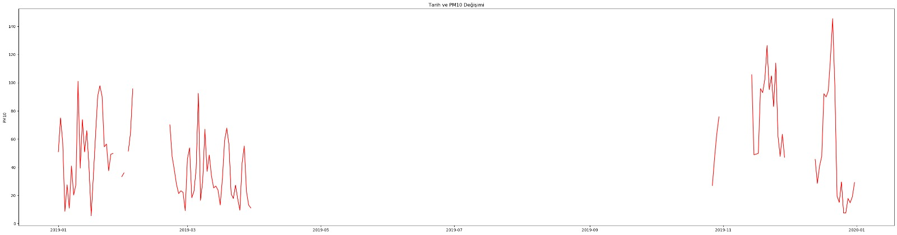

Konya ili için 01.01.2019 - 31.12.2019 tarihine kadar olan tüm veriler görüntüleniyor. Çizilmeyen bazı küçük kesitler ise PM10 değeri bilinmeyen tarihlerdir.

fbprophet modeli kullanılarak 365 günlük tahmin gerçekleştirildi.

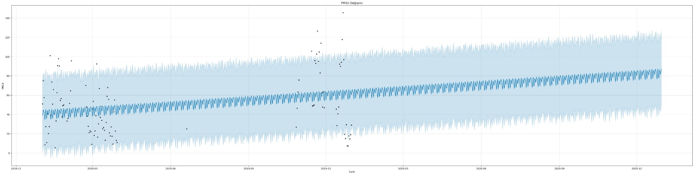

Görselde bulunan noktalar değişim(change point) zamanlarıdır. Bu değerler PM10 değerinin ani değişim geçirdiği zamanlardır. Tahmin ve geçmiş değerlere bakıldığında PM10 Değerinin genel bir artış eğiliminde olduğu görülmektedir. Grafikten yola çıkarak artışın kış aylarında olduğu söylenebilir. Artışın nedeni ısınmak için kullanılan maddelerin (Petrol,kömür) yakılması olabilir. Ayrıca Konya ili sanayi bakımından gelişmiş bir şehir olduğu için bu artış üretimin artışından da kaynaklanıyor olabilir.

Diğer grafikte ise tahmin verilerine ait değerler, yıllık ve günlük olarak eğilimlerin sonuçlarını göstermektedir.

İlk grafiğe bakıldığında değerlerin 2019 yılının başlarından itibaren bir artış gösterdiği ve son aylarda zirveye ulaştığı söylenebilir.

İkinci grafiğe(weekly) baktığımızda PM10 değerinin haftanın hangi günlerinde artış ve azalış gösterdiğini görebiliyoruz. Pazar günleri artmaya başlayan değer Pazartesi gününe kadar zirve noktasını görüyor. Salı günü düşüş olsada haftanın ortasında tepe noktasına ulaşıyor. Cuma günü en dip noktayı gören PM10 Cumartesi en yüksek olduğu noktaya ulaşıyor. Bu artışın sebebi yine Konya şehrinde bulunan ve haftasonları da üretim yapma ihtimali olan Şeker Fabrikası olabilir.

## İstihdam ve İş Gücü Bilgileri

Aşağıdaki grafiklerde 2018 ve 2019 yıllarına ait TUİK Temel İşgücü verileri kullanılmıştır. Türkiye genelinde aylık olarak istihdam ve iş gücü sayıları aylık olarak tutulmuştur.

2018 yılına ait İş Gücü Grafiği(Bin kişi)

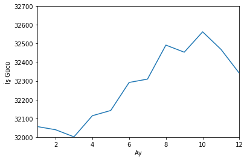

2018 yılına ait İstihdam Grafiği(Bin kişi)

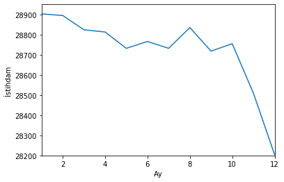

2019 yılına ait İş Gücü Grafiği(Bin kişi)

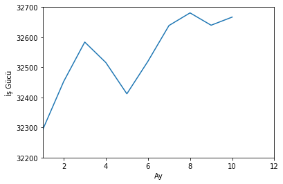

2019 yılına ait İstihdam Grafiği(Bin kişi)

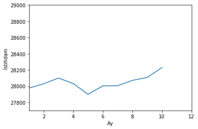

## Sonuç

2019 yılı hava kalitesi verilerine bakıldığı zaman istihtam oranları ile ters orantılı olduğu sonucuna varabiliriz. Çünkü istihtam sayısı azaldıkça hava kalitesi artış göstermektedir. İstihtam sayısı arttıkça da hava kalitesi azalma eyilimindedir. TUİK verileri çok fazla detay içermediği için il bazında gerekli çıkarımlar ve tahminler gerçekleştirilememiştir.

